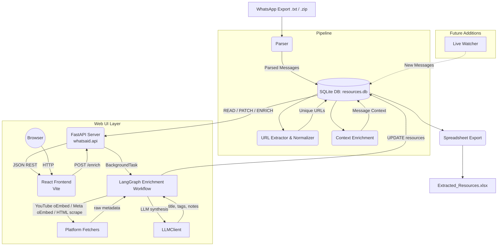

# Architecture

The WhatsApp Chat Information Extractor is designed around a decoupled, pipeline-driven architecture. Rather than processing text directly into a spreadsheet, it uses **SQLite as the central source of truth**, enabling reproducibility, deduplication, and future expansion (like a live watcher or web UI).

## System Data Flow



## Data Model

The application uses a lightweight relational schema stored in `resources.db`:

### `messages` table
Stores the raw chronological chat log.
*   `id`: Primary key
*   `timestamp`: Parsed date/time from WhatsApp
*   `sender`: The person who sent the message
*   `text`: The actual message content (including multi-line continuations)

### `resources` table
Stores the unique, deduplicated resources extracted from the messages.
*   `id`: Primary key
*   `first_message_id`: Foreign key to `messages`, indicating who first shared it
*   `original_url`: The raw URL as extracted
*   `canonical_url`: **UNIQUE**. The URL stripped of tracking parameters (`?utm_source=...`)
*   `platform`: Detected platform (Instagram, YouTube, Airbnb, Google Maps, etc.)
*   `tags`, `title`, `notes`: Metadata fields — auto-populated by the LLM enrichment workflow
*   `context`: Up to 3 surrounding messages providing conversational context
*   `status`: For human review (defaults to "To Review")
*   `enrichment_status`: LLM enrichment state — `pending | done | failed` (null if never enriched)
*   `enriched_at`: ISO datetime when the last enrichment completed

## Package Structure

```
src/whatsaid/
├── __init__.py          # documents public API surface
├── __main__.py          # CLI entry point (argparse, sys.exit on error)
├── core/
│   ├── db.py            # connection, schema init, context-manager cursor
│   ├── parser.py        # regex parsing + DB insertion
│   └── pipeline.py      # end-to-end orchestration (clear → parse → enrich → export)
├── utils/
│   ├── enrichment.py    # context windowing + URL→resource insertion
│   └── url_utils.py     # URL extraction, normalisation, platform detection
├── io/
│   └── export.py        # Excel workbook generation
├── llm/                 # LLM integration layer
│   ├── client.py        # generic litellm wrapper
│   ├── workflow.py      # LangGraph workflow skeleton
│   └── text_to_sql.py   # ✨ NL→SQL: schema context, system prompt, validate_and_clean_sql()
└── api/                 # FastAPI REST layer
    ├── __init__.py
    ├── main.py          # FastAPI app, CORS, uvicorn entry point
    ├── routes.py        # All route handlers (/api/stats, /api/chats, /api/query …)
    ├── queries.py       # Read-path SQL helpers + execute_raw_select()
    └── schemas.py       # Pydantic request/response models
```

> The package is installed in editable mode via `pyproject.toml` (`pip install -e .`),
> so there is no `sys.path` manipulation anywhere in the codebase.

## Core Modules

### `core/db.py`
Manages the SQLite connection and schema. Every public function accepts an
explicit `db_path` parameter (defaulting to `"resources.db"`) — there is no
global path constant, making the module straightforward to test with a
temporary file.

### `core/parser.py`
Contains the regex logic to parse messy, multi-format WhatsApp chat exports
(handling iOS brackets, Android dashes, and narrow no-break spaces before
`am/pm`) into structured records. The internal `_parse_lines()` helper is a
pure function that operates on a list of strings and is independently testable.

### `core/pipeline.py`
Single `run()` function that wires together the four pipeline stages:
`clear_db → parse_whatsapp_chat → process_messages → generate_excel`.
Also handles `.zip` extraction into a temp directory (cleaned up via
`try/finally`). Raises typed exceptions instead of printing errors and
returning silently.

### `utils/url_utils.py`
Responsible for extracting URLs via `urlextract`, stripping tracking
parameters (`utm_*`, `fbclid`, `igshid`, …), and mapping domains to
human-readable platform names. The `URLExtract` instance and tracking-param
set are module-level private constants to avoid repeated instantiation.

### `utils/enrichment.py`
Two clearly separated concerns:
- **`get_context_window()`** — queries the `messages` table for the *N*
  messages before and after a given message ID, returning them as a formatted
  string. Pure read path; closes its connection before returning.
- **`process_messages()`** — iterates all messages, extracts URLs, deduplicates
  via `canonical_url UNIQUE`, then calls `get_context_window()` and inserts
  into `resources`.

### `io/export.py`
Generates the final human-readable `.xlsx` workbook using `openpyxl`, with a
**Resources** sheet and a **Summary** (platform breakdown) sheet. Returns the
row count so callers can log progress without coupling to `print`.

### `__main__.py`
Thin CLI layer (~30 lines). Parses arguments, delegates to `pipeline.run()`,
and calls `sys.exit(1)` on any unhandled exception. Exposes a `--db` flag so
the database path is overridable from the command line.

### `api/main.py`
Creates the `FastAPI` application, registers `CORSMiddleware` (permitting the
Vite dev server on port 5173), and mounts the router. Also exposes a
`start()` function wired to the `whatsaid-api` console script via
`pyproject.toml`.

### `api/routes.py`
Five route handlers grouped under `/api`:
- `GET /api/stats` — Aggregated counts and chart data for the dashboard.
- `GET /api/chats` — Full list of all imported chats.
- `GET /api/resources` — Paginated, filterable resource list (by chat, platform, status, or free-text search).
- `PATCH /api/resources/{id}` — Partial update for status, notes, title, and tags.
- `GET /api/messages` — Paginated, searchable raw message log.

### `api/queries.py`
Read-optimised SQL helpers that return plain `dict` objects. Kept separate from
`core/db.py` to avoid coupling the pipeline write-path to the UI read-path.

### `api/schemas.py`
Pydantic v2 models (`ConfigDict(from_attributes=True)`) for all request and
response bodies, including a `PaginatedResponse` wrapper.

## Design Decisions

1.  **SQLite Over In-Memory Processing:** By storing every message in SQLite,
    we preserve the chronological order. This makes generating the "context
    window" around a URL a simple SQL `ORDER BY id LIMIT` query rather than a
    complex sliding window algorithm over an array.

2.  **Canonical URLs:** Links shared multiple times (e.g.,
    `https://instagram.com/p/123/` and `https://instagram.com/p/123/?igshid=abc`)
    resolve to the same canonical URL, preventing duplicates in the database
    via SQLite's `UNIQUE` constraint.

3.  **Decoupled Ingestion:** Because the pipeline reads from the database
    rather than directly from the parser stream, we can easily add a "Live
    Watcher" in the future that simply inserts rows into the `messages` table,
    automatically triggering the rest of the pipeline.

4.  **No Global State in the DB Layer:** `db_path` is threaded explicitly
    through every function rather than stored in a module-level constant. This
    makes it trivial to point tests at a temp file without monkey-patching, and
    makes the data-flow visible at every call site.
