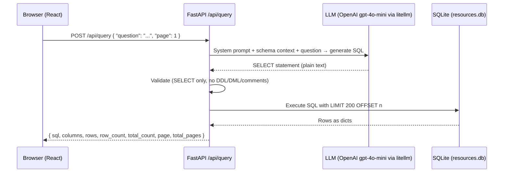

# Feature Design: Natural Language Query ("Ask Your Data")

## 1. Overview

A new **"Ask"** page added to the sidebar. The user types a free-form English question about their WhatsApp chat data. The question is sent to a backend endpoint that uses an LLM to translate it into a safe SQLite `SELECT` statement, executes it against `resources.db`, and returns the result as structured JSON. The frontend renders the result as a dynamic, paginated table and shows the generated SQL for transparency.

**Example queries:**
- *"How many links did Alice share in June?"*
- *"Show me all YouTube links that are still To Review"*
- *"Who sent the most messages last month?"*
- *"List all resources from Instagram shared before March 2025"*

---

## 2. Architecture

### 2.1 Data Flow



### 2.2 Safety Model

The backend **never executes anything the LLM produces verbatim**. It:
1. Strips leading/trailing whitespace and markdown code fences (` ```sql ... ``` `).
2. Asserts the first non-whitespace keyword is `SELECT` (case-insensitive).
3. Rejects queries containing `INSERT`, `UPDATE`, `DELETE`, `DROP`, `CREATE`, `ATTACH`, `PRAGMA`, or `--` (comment injection).
4. Enforces `LIMIT 200 OFFSET n` via a wrapper — the LLM's own LIMIT is overridden.
5. Returns only column names + row data — never the raw DB path or internal errors.

---

## 3. Backend Changes

### 3.1 New Pydantic Schemas — `api/schemas.py`

```python
class NLQueryRequest(BaseModel):
    question: str          # max_length=500
    page: int = 1          # for paginating results

class NLQueryResponse(BaseModel):
    sql: str               # the generated SELECT for transparency
    columns: list[str]
    rows: list[list]       # list of row-tuples serialized as lists
    row_count: int         # rows on this page
    total_count: int       # total matching rows (from COUNT(*) sub-query)
    page: int
    total_pages: int
```

### 3.2 New Query Helper — `api/queries.py`

```python
def execute_raw_select(
    sql: str,
    *,
    db_path: str = DEFAULT_DB_PATH,
    page: int = 1,
    page_size: int = 200,
) -> tuple[list[str], list[list], int]:
    """
    Executes a pre-validated SELECT statement with pagination.
    Returns (column_names, rows_as_lists, total_count).
    total_count is obtained via a COUNT(*) wrapper around the user query.
    """
```

### 3.3 New LLM Helper — `llm/text_to_sql.py`

```python
SCHEMA_CONTEXT = """
-- SQLite schema for 'resources.db'
CREATE TABLE chats (
    id INTEGER PRIMARY KEY,
    name TEXT,
    message_count INTEGER,
    first_message_at TEXT,   -- format: 'YYYY-MM-DD HH:MM:SS'
    last_message_at TEXT,
    import_count INTEGER,
    created_at TEXT,
    updated_at TEXT
);
CREATE TABLE messages (
    id INTEGER PRIMARY KEY,
    chat_id INTEGER,         -- FK -> chats.id
    timestamp TEXT,          -- format: 'YYYY-MM-DD HH:MM:SS'
    sender TEXT,
    text TEXT,
    imported_at TEXT
);
CREATE TABLE resources (
    id INTEGER PRIMARY KEY,
    chat_id INTEGER,         -- FK -> chats.id
    first_message_id INTEGER,-- FK -> messages.id
    original_url TEXT,
    canonical_url TEXT,
    platform TEXT,           -- e.g. 'Instagram', 'YouTube', 'Google Maps'
    tags TEXT,
    title TEXT,
    context TEXT,            -- surrounding message context
    notes TEXT,
    status TEXT              -- values: 'To Review', 'Approved', 'Archived'
);
-- Useful JOINs:
--   resources JOIN messages ON resources.first_message_id = messages.id  (to get sender)
--   resources JOIN chats    ON resources.chat_id = chats.id              (to get chat name)
"""

SYSTEM_PROMPT = """
You are a SQLite query generator for a WhatsApp chat analytics database.
Given a natural-language question, output ONLY a single valid SQLite SELECT statement.
Rules:
- No explanations, no markdown code fences, no inline comments.
- The query must be read-only (SELECT only). No INSERT, UPDATE, DELETE, DROP, CREATE, PRAGMA, or ATTACH.
- Use the exact table and column names from the schema provided.
- Do not add a LIMIT clause; the caller handles pagination.
"""

def generate_sql(question: str, model: str = "gpt-4o-mini") -> str:
    """
    Calls the LLM and returns the raw generated text.
    The caller is responsible for validating and executing the result.
    Model is overridable via the WHATSAID_SQL_MODEL env var.
    """
```

### 3.4 SQL Validation Helper — `llm/text_to_sql.py`

```python
FORBIDDEN_KEYWORDS = {
    "INSERT", "UPDATE", "DELETE", "DROP", "CREATE",
    "ALTER", "ATTACH", "PRAGMA", "DETACH",
}

def validate_and_clean_sql(raw: str) -> str:
    """
    Strips markdown fences, asserts SELECT-only, rejects forbidden keywords.
    Returns the cleaned SQL string, or raises ValueError with a user-safe message.
    """
```

### 3.5 New Route — `api/routes.py`

```
POST /api/query
Body:    NLQueryRequest  { "question": "...", "page": 1 }
Returns: NLQueryResponse { sql, columns, rows, row_count, total_count, page, total_pages }
```

**HTTP error cases:**

| Code | Trigger |
|------|---------|
| `400` | Empty question, LLM returns non-SELECT, forbidden keywords detected, SQL syntax error |
| `503` | LLM API unreachable or `OPENAI_API_KEY` missing |

---

## 4. Frontend Changes

### 4.1 New Page — `ui/src/pages/Ask.jsx`

A single, focused page with three distinct visual states:

#### State 1 — Hero (Empty)
- Large centered `<textarea>` with an animated glowing gradient border (purple → cyan loop).
- Subtitle: *"Ask anything about your chat data"*
- Three clickable **example chips** that pre-fill the textarea:
  - *"Who shared the most links?"*
  - *"Show all YouTube links pending review"*
  - *"How many messages were sent in June?"*
- `Ask →` submit button.

#### State 2 — Loading
- The textarea + button persist at the top (query is locked while loading).
- A shimmer skeleton fills the results area below.
- Status label: *"Thinking…"* with a blinking cursor (`|`) animation.

#### State 3 — Results
- **SQL Disclosure** — a `<details open>` block at the top showing the generated SQL in a styled `<pre>` block. Collapsible. Helps users learn SQL and builds trust.
- **Result summary** — `"Showing {row_count} of {total_count} results"`. If `total_count > page_size` a note clarifies that results are paginated.
- **Dynamic Table** — rendered from `columns` and `rows`:
  - Sticky `<thead>` row.
  - Columns auto-sized (`min-width: 120px`, `max-width: 300px`).
  - URLs detected by pattern are rendered as `<a target="_blank">` links in cyan.
  - Timestamps formatted as locale date strings.
  - Max height `60vh` with `overflow-y: auto` scroll.
  - Horizontal scroll on narrow viewports.
- **Pagination bar** — Previous / Page N of M / Next buttons, same style as Resources page.
- **"New Query"** button (top-right) resets to State 1.

### 4.2 New CSS — `ui/src/pages/Ask.css`

Follows the existing design token system (`index.css`):
- Animated gradient border via `@keyframes border-glow` on the textarea wrapper.
- `.glass-panel` utility applied to the result card.
- `.sql-block` — dark code block with monospace font, subtle syntax coloring via `::first-line` trick for the `SELECT` keyword.
- `.result-table` — sticky header, zebra striping via `tbody tr:nth-child(even)`.
- `.chip` — pill-shaped example query buttons.
- `.skeleton` — shimmer animation for the loading state.

### 4.3 Sidebar Addition — `ui/src/App.jsx`

New `<NavLink to="/ask">` using the `Sparkles` icon from `lucide-react`, inserted below the Messages nav item.

---

## 5. File Change Summary

| File | Change |
|------|--------|
| `src/whatsaid/llm/text_to_sql.py` | **NEW** — schema context, system prompt, `generate_sql()`, `validate_and_clean_sql()` |
| `src/whatsaid/api/schemas.py` | Add `NLQueryRequest`, `NLQueryResponse` |
| `src/whatsaid/api/queries.py` | Add `execute_raw_select()` with pagination |
| `src/whatsaid/api/routes.py` | Add `POST /api/query` route handler |
| `ui/src/pages/Ask.jsx` | **NEW** — 3-state page component |
| `ui/src/pages/Ask.css` | **NEW** — page styles |
| `ui/src/App.jsx` | Add `/ask` route + Sparkles sidebar nav item |
| `docs/ui_design.md` | Add "Ask" page to the feature list |
| `tests/test_text_to_sql.py` | **NEW** — unit tests (TDD, written first) |

---

## 6. Tests (TDD — Write First)

### `tests/test_text_to_sql.py`

```python
# validate_and_clean_sql()
# 1. Raises ValueError on empty string
# 2. Raises ValueError on "DROP TABLE messages"
# 3. Raises ValueError on "-- injection\nSELECT 1"
# 4. Raises ValueError on "UPDATE resources SET status='Approved'"
# 5. Returns cleaned SQL for a valid "SELECT * FROM messages"
# 6. Strips markdown fences: "```sql\nSELECT 1\n```" → "SELECT 1"
# 7. Is case-insensitive: "select * from messages" passes
# 8. Raises ValueError on mixed-case forbidden keyword: "DeLeTe FROM messages"

# execute_raw_select()
# 9.  Returns correct (columns, rows, total_count) on a real temp SQLite DB
# 10. Paginates correctly: page=2 with page_size=2 returns rows 3 and 4
# 11. total_count reflects full result set, not just the current page
```

---

## 7. Finalized Decisions

| Decision | Choice |
|---|---|
| **LLM Provider** | OpenAI via `litellm` (consistent with existing `llm/client.py`) |
| **Model** | `gpt-4o-mini` (overridable via `WHATSAID_SQL_MODEL` env var) |
| **API Key Source** | `.env` at project root — `OPENAI_API_KEY` already present |
| **Row cap** | 200 rows per page, paginated |
| **Auth / multi-user** | Out of scope — single-user local app |
