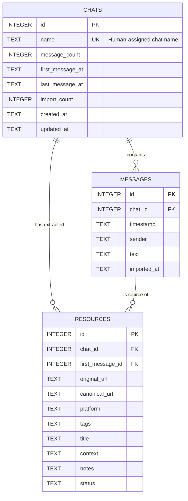

# Database Schema

The `whatsaid` application uses SQLite as the central source of truth for all extracted data. The database uses a single-table design with a `chat_id` partitioning strategy to safely support multiple chats in the same database without data collision.

## ER Diagram

---

## Tables

### `chats`
Acts as the central registry of all imported conversations. The user manually specifies the chat name at import time.

| Column | Type | Constraints | Description |
|---|---|---|---|
| `id` | `INTEGER` | `PRIMARY KEY` | |
| `name` | `TEXT` | `UNIQUE`, `NOT NULL` | The human-assigned name for the chat |
| `message_count` | `INTEGER` | `DEFAULT 0` | Total number of messages in this chat |
| `first_message_at` | `TEXT` | | Timestamp of the earliest message |
| `last_message_at` | `TEXT` | | Timestamp of the latest message |
| `import_count` | `INTEGER` | `DEFAULT 0` | How many times this chat was imported/appended |
| `created_at` | `TEXT` | `DEFAULT now()` | DB insertion time |
| `updated_at` | `TEXT` | `DEFAULT now()` | Last update time |

---

### `messages`
Stores the raw chronological chat log across all chats.

| Column | Type | Constraints | Description |
|---|---|---|---|
| `id` | `INTEGER` | `PRIMARY KEY` | |
| `chat_id` | `INTEGER` | `NOT NULL`, `FK -> chats.id` | Which chat this message belongs to. Uses `ON DELETE CASCADE` |
| `timestamp` | `TEXT` | | Parsed date/time from WhatsApp |
| `sender` | `TEXT` | | The person who sent the message |
| `text` | `TEXT` | | The actual message content (including multi-line) |
| `imported_at` | `TEXT` | `DEFAULT now()` | Wall-clock time of when the message was inserted |

**Indexes & Constraints:**
*   `UNIQUE (chat_id, timestamp, sender, text)`: Composite unique constraint used for safely appending new messages and skipping already-seen ones via `INSERT OR IGNORE`.
*   `idx_messages_chat`: Index on `chat_id`.

---

### `resources`
Stores the unique, deduplicated URLs and resources extracted from messages.

| Column | Type | Constraints | Description |
|---|---|---|---|
| `id` | `INTEGER` | `PRIMARY KEY` | |
| `chat_id` | `INTEGER` | `NOT NULL`, `FK -> chats.id` | Which chat this resource was found in. Uses `ON DELETE CASCADE` |
| `first_message_id` | `INTEGER` | `FK -> messages.id` | The ID of the message that first shared this URL |
| `original_url` | `TEXT` | | The raw URL as extracted |
| `canonical_url` | `TEXT` | | The URL stripped of tracking parameters (`?utm_source=...`) |
| `platform` | `TEXT` | | Detected platform (Instagram, YouTube, Google Maps, etc.) |
| `tags` | `TEXT` | | Metadata field (unpopulated) |
| `title` | `TEXT` | | Metadata field (unpopulated) |
| `context` | `TEXT` | | Up to 3 surrounding messages providing conversational context |
| `notes` | `TEXT` | | Metadata field (unpopulated) |
| `status` | `TEXT` | `DEFAULT 'To Review'` | Status for human review |

**Indexes & Constraints:**
*   `UNIQUE (chat_id, canonical_url)`: Scopes URL deduplication per-chat. The same canonical URL shared in two different chats will generate two separate resource records with their own context.
*   `idx_resources_chat`: Index on `chat_id`.
